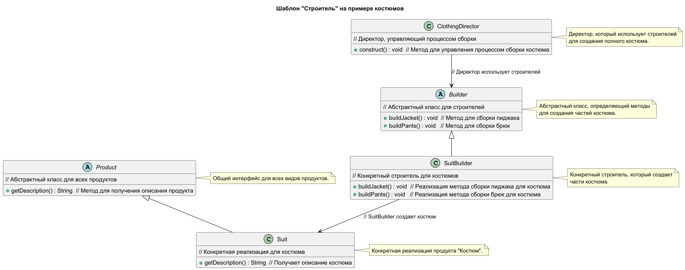

# Шаблон "Строитель"

### Пример паттерна на react

https://www.npmjs.com/package/smetaniny-react-form-builder

Шаблон "Строитель" отделяет процесс создания сложного объекта от его представления, так что один и тот же процесс может
использоваться для создания различных представлений объекта. Это позволяет создавать объекты пошагово, постепенно
добавляя детали.

## Что это такое?

Шаблон "Строитель" используется для пошагового построения сложных объектов. Он позволяет управлять процессом создания и
отделяет его от самой структуры создаваемого объекта. Это особенно полезно, когда объект состоит из множества частей и
имеет сложные конфигурации.

## Когда использовать?

- Когда необходимо создать сложный объект, состоящий из множества частей.
- Когда нужно создать различные представления одного и того же объекта, используя один и тот же процесс.
- Когда процесс построения должен быть гибким и контролируемым.

## Как это работает?

### Компоненты:

1. **Строитель:** Определяет интерфейс для пошагового создания объекта.
2. **Конкретные строители:** Реализуют интерфейс строителя, создавая конкретные представления объекта.
3. **Директор:** Управляет процессом построения, вызывая методы строителя по порядку.
4. **Продукт:** Конечный сложный объект, который строится.

## Плюсы

- **Гибкость:** Позволяет изменять процесс создания объектов без необходимости менять код клиента.
- **Упрощение создания:** Упрощает создание сложных объектов с множеством вариантов конфигурации.
- **Отделение логики:** Разделяет логику построения и структуру объекта, что упрощает поддержку и расширение.

## Минусы

- **Усложнение кода:** Может потребоваться создать множество классов (строителей) для разных представлений объекта, что
  увеличивает сложность системы.
- **Избыточность:** В случаях, когда объект не слишком сложен, использование "Строителя" может быть излишним и усложнять
  код.
- **Необходимость директора:** Для управления процессом может понадобиться отдельный класс (директор), что добавляет
  дополнительный уровень абстракции.

## Почему это полезно?

- Позволяет легко создавать сложные объекты с различными конфигурациями.
- Разделяет логику построения и конечный объект, что упрощает поддержку и расширение системы.
- Позволяет изменять процесс построения без изменения клиентского кода.

## Структура

## Применимость

- Алгоритм создания сложного объекта не должен зависеть от того, из каких частей состоит объект и как они стыкуются
  между собой.
- Процесс конструирования должен обеспечивать различные представления конструируемого объекта.

## Участники

- **Builder (Builder)** - задает абстрактный интерфейс для создания частей объекта Product.
- **ConcreteBuilder (DressBuilder, SuitBuilder)** - конкретные строители. Конструируют и собирают вместе части
  продукта (платье или костюм) посредством реализации интерфейса Builder. Определяют создаваемые представления и следят
  за ними. Предоставляют интерфейс для доступа к продукту.
- **Director (ClothingDirector)** - распорядитель. Конструирует объект, пользуясь интерфейсом Builder.
- **Product (Dress, Suit)** - продукт. Представляет сложный конструируемый объект. ConcreteBuilder строит внутреннее
  представление продукта и определяет процесс его сборки. Включает классы, которые определяют составные части, в том
  числе интерфейсы для сборки конечного результата из частей.

## Отношения

- Клиент создает объект-распорядитель Director и настраивает его нужным объектом-строителем Builder.
- Распорядитель уведомляет строителя о том, что нужно построить очередную часть продукта.
- Строитель обрабатывает запросы распорядителя и добавляет новые части к продукту.
- Клиент забирает продукт у строителя.

# Паттерн "Строитель" в интернет-магазине

## Описание паттерна "Строитель"

Паттерн "Строитель" (Builder) позволяет пошагово создавать сложные объекты, отделяя процесс их создания от
представления. Это особенно полезно, когда объект состоит из множества компонентов и требует гибкости в конфигурации.

## Пример использования в интернет-магазине

### Создание Заказов

В интернет-магазине паттерн "Строитель" может быть использован для формирования заказов. Заказ может включать в себя
несколько товаров, применяемые скидки, различные способы доставки и методы оплаты. Используя строитель, менеджеры или
клиенты могут добавлять товары к заказу поэтапно, устанавливать скидки и выбирать способы доставки. Это позволяет легко
и быстро создавать заказы, адаптируя их под нужды конкретного клиента.

### Персонализация Товаров

Другим примером использования паттерна "Строитель" является персонализация товаров. Например, при заказе одежды в
интернет-магазине клиент может выбрать различные опции, такие как размер, цвет и материал. Паттерн "Строитель" позволяет
пошагово настраивать эти параметры, создавая уникальный продукт для каждого клиента.

### Создание Комплектов Товаров

В интернет-магазинах часто предлагаются комплекты товаров, такие как подарочные наборы. Паттерн "Строитель" позволяет
менеджерам по продажам или клиентам удобно собирать комплект из различных товаров, добавляя и удаляя их по мере
необходимости, и в конце получая единый продукт с комплексным описанием.

## Когда не стоит использовать паттерн "Строитель"

### Простые Объекты

Если создаваемый объект состоит из нескольких простых атрибутов и не требует сложной логики, использование паттерна
"Строитель" может привести к ненужному усложнению кода. Например, создание объекта для описания книги с полями
"название", "автор" и "год издания" может быть реализовано проще, чем через строитель.

### Непостоянные Объекты

Паттерн "Строитель" не рекомендуется использовать, когда объект часто меняет свои свойства или конфигурации. Например, в
системах, где товары могут часто обновляться (например, в случае динамических цен или акций), простое создание объекта с
помощью конструктора или фабрики будет более эффективным и менее сложным.

### Отсутствие Необходимости в Разных Представлениях

Если объект всегда имеет одинаковую структуру и не требует создания различных конфигураций, паттерн "Строитель"
становится излишним. Например, если у вас есть объект "Клиент" с фиксированным набором атрибутов, как имя, адрес и
телефон, использование строителя для его создания может быть неоправданным.

## Заключение

Паттерн "Строитель" является мощным инструментом для управления созданием сложных объектов, особенно когда требуется
гибкость и возможность изменения конфигураций. Однако его использование должно быть обоснованным, чтобы избежать
избыточной сложности и сделать код более понятным и поддерживаемым.

